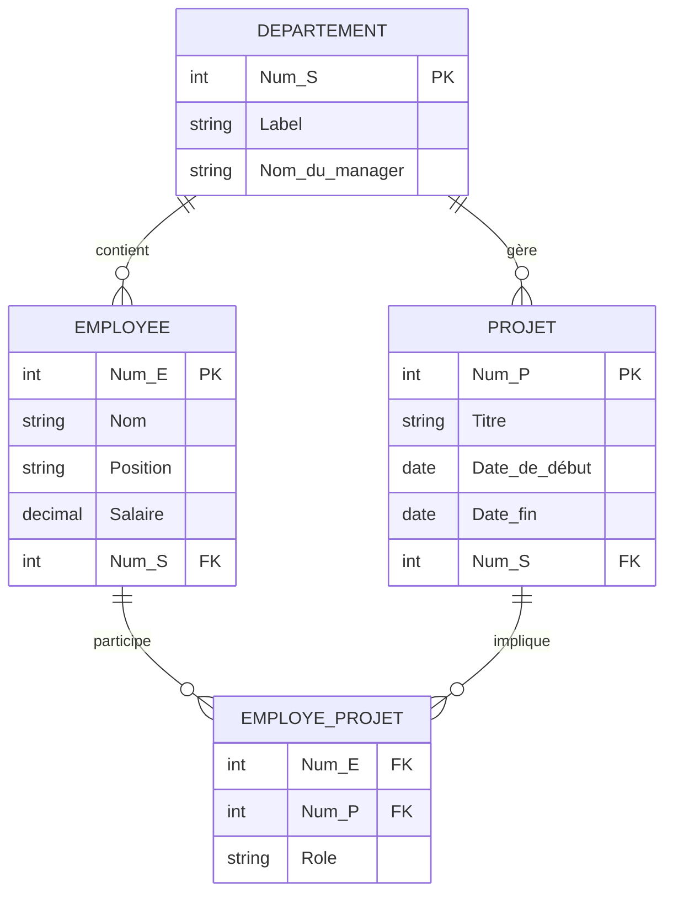

# Système d'Information sur la Participation des Salariés 📊

Ce projet consiste à concevoir et mettre en œuvre le schéma d'une base de données SQL pour gérer la participation des employés aux projets au sein d'une organisation.

## 📝 Description du Projet

L'objectif est de suivre les informations relatives aux employés, aux départements et aux projets, ainsi que les rôles spécifiques que chaque employé occupe au sein de différents projets. Ce système garantit l'intégrité des données grâce à l'utilisation de clés primaires, de clés étrangères et de contraintes de domaine.

## 🏗️ Structure de la Base de Données

Le schéma est composé de quatre tables principales :

### 1. Département (`Departement`)
Gère les informations relatives aux services de l'entreprise.
- **Num_S** (PK) : Identifiant unique du département.
- **Label** : Nom du département.
- **Nom_du_manager** : Nom du responsable.

### 2. Employé (`Employee`)
Enregistre les données personnelles et professionnelles des salariés.
- **Num_E** (PK) : Identifiant unique de l'employé.
- **Nom** : Nom complet.
- **Position** : Poste occupé.
- **Salaire** : Rémunération.
- **Num_S** (FK) : Département d'appartenance.

### 3. Projet (`Projet`)
Permet de suivre les projets en cours et passés.
- **Num_P** (PK) : Identifiant unique du projet.
- **Titre** : Nom du projet.
- **Date_de_début** : Date de lancement.
- **Date_fin** : Date de clôture.
- **Num_S** (FK) : Département responsable du projet.

### 4. Participation (`Employé_Projet`)
Table d'association pour gérer la relation plusieurs-à-plusieurs entre les employés et les projets.
- **Num_E** (FK) : Référence à l'employé.
- **Num_P** (FK) : Référence au projet.
- **Rôle** : Rôle spécifique de l'employé dans le projet.
- **PK Composite** : (Num_E, Num_P)

## 🛠️ Installation et Utilisation

1.  Assurez-vous d'avoir un système de gestion de base de données (ex: SQL Server, PostgreSQL, MySQL) installé.
2.  Clonez ce dépôt :
    ```bash
    git clone https://github.com/ramshish1/DDL_SQL.git
    ```
3.  Exécutez le script SQL pour créer la base de données et les tables :
    ```sql
    -- Ouvrez et exécutez DDL_Checkpoint.sql
    ```

## 📐 Modèle Relationnel (Mermaid)



## 🚀 Technologies Utilisées
- **SQL** (Structured Query Language)
- **DDL** (Data Definition Language)

---
*Projet réalisé dans le cadre du point de contrôle DDL.*
